# ⚛️ Awesome Quantum Algorithm Development 🚀

**A curated list of state-of-the-art quantum algorithm design frameworks, hybrid quantum-classical software development kits (SDKs), simulators, error mitigation tools, and commercial cloud platforms.**

---

## 💡 Overview & Scope

Quantum computing is evolving rapidly from NISQ (Noisy Intermediate-Scale Quantum) devices toward fault-tolerant quantum architectures. This repository provides a comprehensive directory for quantum software engineers, researchers, and enterprise developers. 

- 🌟 **Open-Source Core:** Prioritizing open-source frameworks, quantum compilers, and computational chemistry libraries.
- ☁️ **SaaS & Cloud Platforms:** Documenting enterprise-grade quantum execution services, cloud QPUs, and error suppression tools with clear financial and usage metrics.

---

## ☁️ SaaS / Hosted Platforms

Below is a curated comparison of commercial quantum cloud platforms and enterprise software suites, sorted in descending order by company valuation / market capitalization 💰.

| 🏢 Platform | 📝 Description | 🎯 Key Focus | 💰 Valuation / Market Cap | 💵 Pricing | 🎁 Free Tier Limits |
|:---|:---|:---|:---|:---|:---|
| **[IBM Qiskit Runtime](https://quantum.cloud.ibm.com/)** | Cloud-native execution service for Qiskit. Provides primitives (Sampler, Estimator), sessions, error mitigation, and efficient hybrid loops. | Production-grade execution on IBM hardware | ~$223.5 Billion (Market Cap) | Pay-As-You-Go Plan starting at $96/minute of QPU execution time | Open Plan: 10 minutes of quantum processing QPU runtime per 28-day rolling window |
| **[Quantinuum InQuanto](https://www.quantinuum.com/products-solutions/inquanto)** | Proprietary quantum computational chemistry platform built on TKET. Tailored for molecular and materials simulations with industry collaborations. | Quantum chemistry on Quantinuum hardware | ~$15.4 Billion (Market Cap) | Enterprise platform licensing (custom quotes for hardware & software access) | Free evaluation trial access upon application request |
| **[D-Wave Leap](https://cloud.dwavesys.com/)** (with Ocean) | Cloud access to quantum annealers and hybrid solvers. Ocean SDK is the open-source companion. | Quantum annealing & hybrid optimization | ~$7.5 Billion (Market Cap) | Enterprise & custom plans (contact sales for paid compute tiers) | Leap Quantum LaunchPad: 3-month free trial for qualified developers; standard trial: 1 minute QPU solver time/month |
| **[Pasqal](https://www.pasqal.com/)** | Full-stack neutral-atom platform with cloud access, solvers for optimization/graph ML, and managed execution. | Neutral-atom algorithms, industrial optimization | ~$2.6 Billion (Pro Forma Valuation) | Pay-as-you-go QPU execution (via GCP / Azure Quantum) | Permanent free Explorer tier: unlimited access to Pasqal emulators and Pulser Studio |
| **[Q-CTRL](https://q-ctrl.com/)** (Fire Opal / Boulder Opal) | Infrastructure software for error suppression, automated performance optimization, and hardware control. Fire Opal provides turnkey error mitigation for algorithms. | Error suppression, control systems, algorithmic acceleration | ~$250 Million+ (Series B Raised $166M) | Fire Opal Paid / Boulder Opal Professional (custom quotes) | Fire Opal Free: 10 API calls per function/day; Boulder Opal Basic: 12 cloud machine hours (4 vCPU, 32 GB RAM) |
| **[Classiq](https://www.classiq.io/)** | High-level quantum algorithm design platform. Users describe functional models; the synthesis engine automatically generates optimized circuits for multiple backends. | Algorithm synthesis, resource estimation, multi-hardware compilation | ~$150 Million (Total Raised $63M+) | Enterprise ($30,000/developer seat/year starting tier) | Academic/Non-commercial free access (requires registration & approval) |
| **[QC Ware Forge / Promethium](https://www.qcware.com/)** | Enterprise quantum software platform with turnkey algorithms for optimization, ML, and chemistry. Promethium focuses on GPU-accelerated quantum chemistry. | Quantum ML, optimization, computational chemistry | ~$100 Million (Series B Raised $33M+) | Enterprise subscription (custom quotes based on seat/compute scale) | 30-day evaluation trial / limited initial simulator compute credits |
| **[Strangeworks](https://strangeworks.com/)** | Unified compute platform providing access to quantum hardware, simulators, and classical/quantum-inspired solvers through a single interface and Python SDK. | Multi-backend access, hybrid workflows | ~$80 Million (Series A Raised $24M+) | Pay-as-you-go compute / Premium workspace subscriptions | Community Edition free platform access & simulator compute; variable trial credits via Backstage Pass program |
| **[Zapata Orquestra](https://zapataquantum.com/)** | Unified platform for building, validating, and deploying hybrid quantum-classical applications. Includes use-case database, AI-assisted development, and QuantumOps tooling. | Enterprise application development & benchmarking | ~$50 Million (Total Raised $67M+) | Enterprise licensing (custom quotes for annual/multi-year contracts) | 60-day enterprise free trial / open-source core Python SDKs |
| **[BlueQubit](https://www.bluequbit.io/)** | Cloud platform for high-performance simulation (CPU/GPU/MPS/Pauli-path) and access to leading QPUs (IBM, Quantinuum). Includes AI assistant for circuit design. | Large-scale simulation & quantum advantage experiments | ~$10 Million (Seed Stage) | Standard Plan at $20/month (includes $20 monthly credits) | Permanent free access to 34-qubit CPU simulator |

---

## 🔓 Open-Source Softwares

These open-source repositories form the cornerstone of quantum algorithm research, hybrid optimization, and quantum compiler design. Sorted in descending order by GitHub star count ⭐.

| 🛠️ Project | ⭐Stars_____ | 📝 Description | 📜 License / Focus |
|:---|:---|:---|:---|
| **[Qiskit](https://github.com/Qiskit/qiskit)** |  | IBM’s full-stack open-source SDK for circuit construction, transpilation, and quantum primitives. | Apache 2.0 |
| **[Cirq](https://github.com/quantumlib/Cirq)** |  | Google’s framework for NISQ algorithms, hardware-aware circuit design, and QPU execution. | Apache 2.0 |
| **[PennyLane](https://github.com/PennyLaneAI/pennylane)** |  | Differentiable quantum programming for quantum machine learning, chemistry, and hybrid optimization. | Apache 2.0 |
| **[QuTiP](https://github.com/qutip/qutip)** |  | Quantum Toolbox in Python – open system dynamics, master equation solver, and pulse simulation. | BSD 3-Clause |
| **[OpenFermion](https://github.com/quantumlib/OpenFermion)** |  | Open-source framework for compiling and analyzing quantum algorithms for electronic structure. | Apache 2.0 |
| **[CUDA-Q](https://github.com/NVIDIA/cuda-quantum)** |  | NVIDIA’s high-performance hybrid quantum-classical platform with GPU-accelerated QPU simulation. | Apache 2.0 |
| **[Q# + QDK](https://github.com/microsoft/qsharp)** |  | Microsoft’s quantum programming language, domain compiler, and resource estimator. | MIT |
| **[ProjectQ](https://github.com/ProjectQ-Framework/ProjectQ)** |  | Modular open-source framework with high-level compilation and diverse hardware backends. | Apache 2.0 |
| **[Strawberry Fields](https://github.com/XanaduAI/strawberryfields)** |  | Xanadu’s full-stack Python library for continuous-variable photonic quantum computing. | Apache 2.0 |
| **[Stim](https://github.com/quantumlib/Stim)** |  | Ultra-fast stabilizer circuit simulator for quantum error correction and Clifford circuits. | Apache 2.0 |
| **[Ocean SDK](https://github.com/dwavesystems/dwave-ocean-sdk)** |  | D-Wave’s open-source suite for formulating QUBO/Ising models and solving on quantum annealers. | Apache 2.0 |
| **[Mitiq](https://github.com/unitaryfoundation/mitiq)** |  | Unitary Foundation’s compiler for error mitigation (ZNE, PEC) on noisy intermediate-scale quantum devices. | GPL-3.0 |
| **[Qiskit Nature](https://github.com/Qiskit/qiskit-nature)** |  | IBM Qiskit module for solving chemistry and quantum materials physics problems. | Apache 2.0 |
| **[Qualtran](https://github.com/quantumlib/Qualtran)** |  | Google’s library for designing and resource-estimating fault-tolerant quantum algorithms. | Apache 2.0 |
| **[Qibo](https://github.com/qiboteam/qibo)** |  | Open-source API for quantum simulation, hardware control, and hybrid execution. | Apache 2.0 |
| **[TKET / pytket](https://github.com/Quantinuum/tket)** |  | Quantinuum’s high-performance quantum compiler providing state-of-the-art circuit optimization. | Apache 2.0 |
| **[Qrisp](https://github.com/eclipse-qrisp/qrisp)** |  | Eclipse high-level programming language with automatic uncomputation and memory management. | EPL 2.0 |
| **[Pulser](https://github.com/pasqal-io/Pulser)** |  | Pasqal’s pulse-level programming library for neutral-atom quantum processors. | Apache 2.0 |
| **[Bloqade](https://github.com/QuEraComputing/Bloqade.jl)** |  | QuEra’s Julia package for analog quantum computation and neutral-atom array simulation. | Apache 2.0 |
| **[PennyLane Lightning](https://github.com/PennyLaneAI/pennylane-lightning)** |  | High-performance C++ state-vector and GPU simulator plugin for PennyLane. | Apache 2.0 |
| **[Guppy](https://github.com/Quantinuum/guppylang)** |  | Quantinuum’s embedded Pythonic language for hybrid quantum-classical programming. | Apache 2.0 |
| **[MQT Core](https://github.com/cda-tum/mqt-core)** |  | Munich Quantum Toolkit core library for decision-diagram based synthesis and verification. | MIT |
| **[qBraid SDK](https://github.com/qBraid/qBraid)** |  | Cross-framework quantum transpiler and unified hardware execution toolkit. | GPL-3.0 |
| **[ffsim](https://github.com/qiskit-community/ffsim)** |  | IBM Qiskit community high-performance fermionic quantum circuit simulator. | Apache 2.0 |
| **[Qadence](https://github.com/pasqal-io/qadence)** |  | Pasqal’s digital-analog quantum programming interface for quantum machine learning. | Apache 2.0 |
| **[Quandary](https://github.com/llnl/quandary)** |  | Lawrence Livermore National Lab (LLNL) optimal control solver for open/closed quantum systems. | MIT |
| **[Open Quantum Design (equilux)](https://github.com/OpenQuantumDesign/equilux)** |  | Open trapped-ion hardware/software full-stack stack and control orchestration. | Apache 2.0 |

---

## 🎯 Quick Start Recommendations

| 🏁 Goal | 🚀 Recommended Starting Framework / Tool |
|:---|:---|
| **General Quantum Algorithm Development** | **Qiskit** or **PennyLane** |
| **Quantum Machine Learning (QML)** | **PennyLane** or **Qadence** |
| **Computational Chemistry & Materials** | **OpenFermion** + **Qiskit Nature** or **InQuanto** |
| **Neutral-Atom Analog Simulation** | **Pulser** + **Bloqade** |
| **Quantum Annealing & Optimization** | **Ocean SDK** |
| **High-Performance GPU-QPU Workflows** | **CUDA-Q** |
| **Circuit Transpilation & Compiler Research** | **TKET / pytket** or **MQT Core** |
| **Quantum Error Mitigation Research** | **Mitiq** or **Q-CTRL Fire Opal** |
| **Fault-Tolerant Algorithm Design** | **Qualtran** + **Stim** |

---

## 🤝 Contributing

Contributions, corrections, and new open-source projects are welcome!  
Please submit a pull request or open an issue to suggest additions.

---

## 📈 Star History

<a href="https://www.star-history.com/?repos=ishandutta2007%2FAwesome-Quantum-Algorithm-Development&type=date&legend=bottom-right">
<picture>
<source media="(prefers-color-scheme: dark)" srcset="https://api.star-history.com/chart?repos=ishandutta2007/Awesome-Quantum-Algorithm-Development&type=date&theme=dark&legend=bottom-right" />
<source media="(prefers-color-scheme: light)" srcset="https://api.star-history.com/chart?repos=ishandutta2007/Awesome-Quantum-Algorithm-Development&type=date&legend=bottom-right" />

</picture>
</a>

---

**Last updated:** August 2026  
*Maintained with ❤️ by the Quantum Computing Community.*
